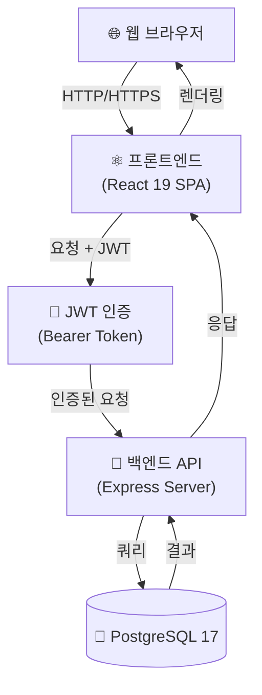
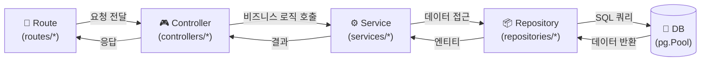
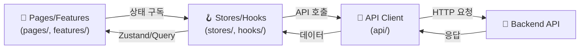
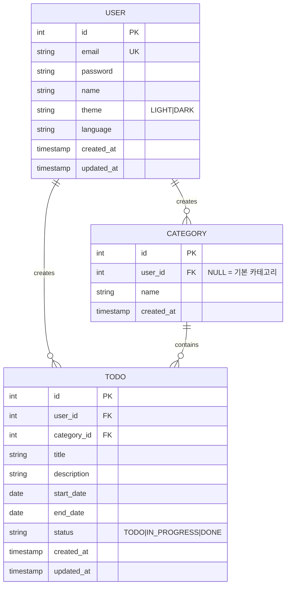
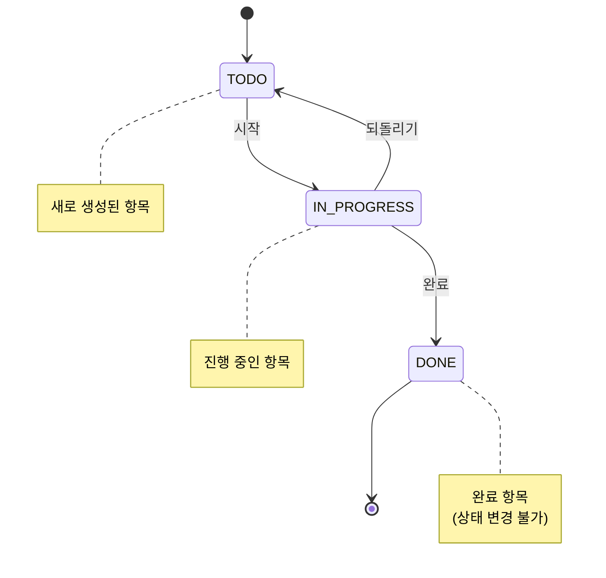

# TodoList 앱 기술 아키텍처 다이어그램

**작성자**: GWJung | **버전**: 1.0 | **작성일**: 2026-05-27

---

## 다이어그램 1: 시스템 전체 구성

브라우저에서 시작하는 전체 시스템 흐름을 나타냅니다. React SPA와 Express 백엔드 간 JWT 기반 인증 통신을 포함합니다.

---

## 다이어그램 2: 백엔드 레이어 아키텍처

요청이 Route에서 시작하여 각 계층을 순차적으로 통과하며 데이터에 접근하는 구조입니다.

---

## 다이어그램 3: 프론트엔드 레이어 아키텍처

UI 컴포넌트에서 시작하여 상태 관리와 API 통신을 거쳐 백엔드와 상호작용하는 구조입니다.

---

## 다이어그램 4: 엔티티 관계 다이어그램 (ERD)

세 가지 핵심 엔티티와 그들 간의 관계, 각 엔티티의 주요 속성을 표현합니다.

---

## 다이어그램 5: Todo 상태 전이 다이어그램

Todo 항목의 생명주기를 나타냅니다. 허용된 상태 전이와 불가능한 전이를 표현합니다.

---

## 요약

| 계층             | 기술                    | 역할                         |
| ---------------- | ----------------------- | ---------------------------- |
| **클라이언트**   | React 19, TypeScript    | UI 렌더링, 사용자 상호작용   |
| **상태 관리**    | Zustand, TanStack Query | 클라이언트 상태, 서버 동기화 |
| **HTTP 통신**    | fetch (내장)            | 백엔드와의 데이터 교환       |
| **인증**         | JWT (Bearer Token)      | 사용자 인증 및 권한 검증     |
| **서버**         | Express.js              | API 엔드포인트 제공          |
| **데이터 접근**  | pg.Pool, Repository     | 데이터베이스 쿼리 실행       |
| **데이터베이스** | PostgreSQL 17           | 데이터 영구 저장             |
| **다국어 (v2)**  | react-i18next           | 다국어 지원                  |
