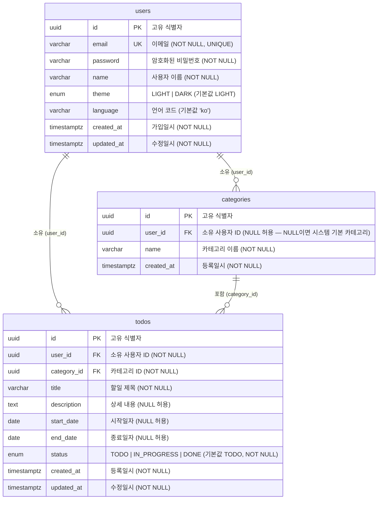

# ERD (Entity Relationship Diagram)

- 작성자: GWJung
- 버전: 1.0
- 작성일: 2026-05-27

---

## 1. 메인 ERD



---

## 2. 비즈니스 규칙 보충 설명

### 기본 카테고리 (user_id = NULL) 동작 방식

- `categories.user_id`가 `NULL`인 카테고리는 시스템 전역 기본 카테고리이다.
- 이 카테고리는 특정 사용자에게 귀속되지 않으며, 모든 사용자가 공유한다.
- Todo 등록 시 카테고리를 명시하지 않으면 이 기본 카테고리의 ID가 `todos.category_id`에 저장된다.
- ERD의 `users ||--o{ categories` 관계에서 `user_id = NULL`인 행은 해당 FK 관계 바깥에 존재하는 예외 케이스이다.

### Todo status 전이 규칙

- 허용 전이 경로: `TODO` → `IN_PROGRESS` → `DONE`
- `DONE` 상태에서 다른 상태로의 역전이는 불가하다.
- 애플리케이션 레이어에서 전이 유효성을 검증한다.

| 현재 상태   | 전이 가능 상태 |
| ----------- | -------------- |
| TODO        | IN_PROGRESS    |
| IN_PROGRESS | DONE           |
| DONE        | (불가)         |

### end_date >= start_date 제약

- `todos.start_date`와 `todos.end_date`가 모두 NOT NULL일 경우, `end_date`는 반드시 `start_date` 이상이어야 한다.
- PostgreSQL CHECK 제약으로 구현한다.
  ```sql
  CONSTRAINT chk_date_range CHECK (end_date IS NULL OR start_date IS NULL OR end_date >= start_date)
  ```

---

## 3. 테이블 정의 요약

### users

| 컬럼       | 타입                 | 제약조건                  | 설명              |
| ---------- | -------------------- | ------------------------- | ----------------- |
| id         | UUID                 | PK, NOT NULL              | 고유 식별자       |
| email      | VARCHAR(255)         | UNIQUE, NOT NULL          | 이메일            |
| password   | VARCHAR(255)         | NOT NULL                  | 암호화된 비밀번호 |
| name       | VARCHAR(100)         | NOT NULL                  | 사용자 이름       |
| theme      | ENUM('LIGHT','DARK') | NOT NULL, DEFAULT 'LIGHT' | UI 테마           |
| language   | VARCHAR(10)          | NOT NULL, DEFAULT 'ko'    | 언어 코드         |
| created_at | TIMESTAMPTZ          | NOT NULL                  | 가입일시          |
| updated_at | TIMESTAMPTZ          | NOT NULL                  | 수정일시          |

### categories

| 컬럼       | 타입         | 제약조건                 | 설명                                |
| ---------- | ------------ | ------------------------ | ----------------------------------- |
| id         | UUID         | PK, NOT NULL             | 고유 식별자                         |
| user_id    | UUID         | FK → users.id, NULL 허용 | 소유 사용자 ID (NULL = 시스템 기본) |
| name       | VARCHAR(100) | NOT NULL                 | 카테고리 이름                       |
| created_at | TIMESTAMPTZ  | NOT NULL                 | 등록일시                            |

### todos

| 컬럼        | 타입                              | 제약조건                                  | 설명           |
| ----------- | --------------------------------- | ----------------------------------------- | -------------- |
| id          | UUID                              | PK, NOT NULL                              | 고유 식별자    |
| user_id     | UUID                              | FK → users.id, NOT NULL                   | 소유 사용자 ID |
| category_id | UUID                              | FK → categories.id, NOT NULL              | 카테고리 ID    |
| title       | VARCHAR(255)                      | NOT NULL                                  | 할일 제목      |
| description | TEXT                              | NULL 허용                                 | 상세 내용      |
| start_date  | DATE                              | NULL 허용                                 | 시작일자       |
| end_date    | DATE                              | NULL 허용, CHECK (end_date >= start_date) | 종료일자       |
| status      | ENUM('TODO','IN_PROGRESS','DONE') | NOT NULL, DEFAULT 'TODO'                  | 진행 상태      |
| created_at  | TIMESTAMPTZ                       | NOT NULL                                  | 등록일시       |
| updated_at  | TIMESTAMPTZ                       | NOT NULL                                  | 수정일시       |
